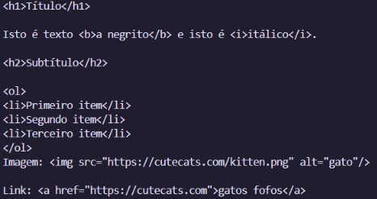

# TPC 2: Conversor de MarkDown para HTML

## Autor
Feito por Rita Machado, A108400

## Resumo
Este trabalho teve como objetivo fazer um pequeno conversor de MarkDown para HTML em Python, cobrindo os seguintes elementos:
- **Cabeçalhos:** linhas iniciadas por `#`, `##`, `###` em `<h1>`, `<h2>`e `<h3>`.
- **Texto a negrito:** (`**texto**` para `<b>texto</b>`) e **Texto em itálico** (`*texto*` para `<i>texto</i>`).
- **Listas numeradas:** converter listas numeradas (`1. item`), em blocos de `<ol>`com elementos individuais `<li>`.
- **Links e Imagens:** conversão de links (`[texto](url)` para `<a href="url">texto</a>`) e de imagens (`` para ``).

Numa função, foram feitas as devidas expressões regulares para atender a cada conversão pedida, tendo em atenção a ordem de aplicação de algumas delas: o negrito antes do itálico ( o negrito utiliza dois asteriscos, enquanto que o itálico apenas um); e a imagem antes do link (a sintaxe do link encontra-se dentro da sintaxe da imagem).

Esta função foi então validada com um pequeno exemplo, demonstrando cada elemento pedido.

## Lista de Resultados
- [Conversor](mdTohtml.py)
- Print do resultado em HTML

